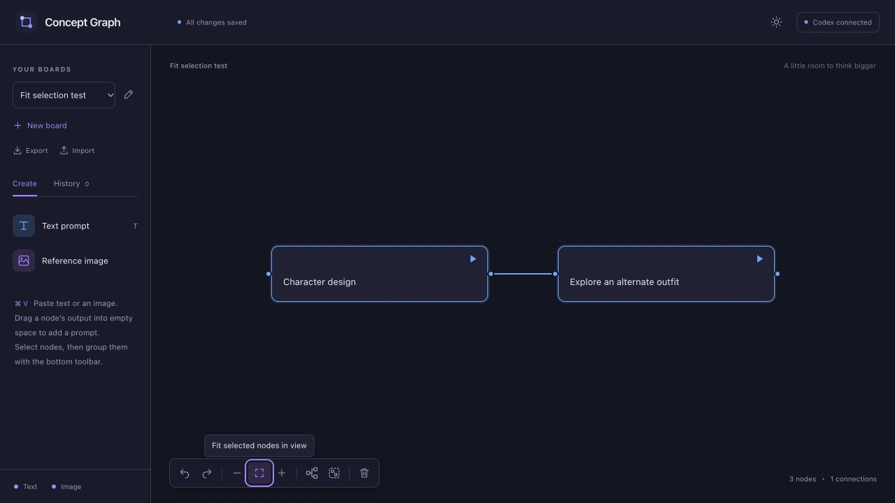
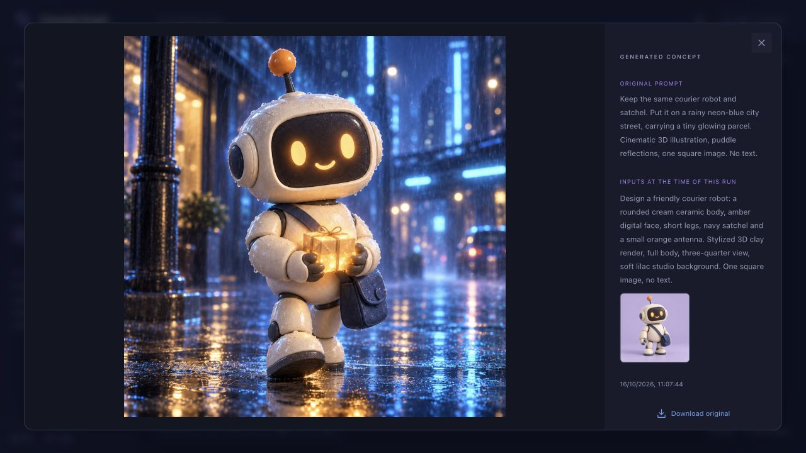

# Concept Graph

**English** | [Українська](README.uk.md)

**A local canvas for image ideas and their evolution.**

Write a prompt, connect references, and run it. Generated images appear as connected nodes. Branch from any result, compare directions, and keep the path that led there.

Active runs show temporary output nodes with looping muted videos (text descriptions use a shimmer), and the personal **Videos while generating** switch in **Settings** or your system’s reduced-motion setting replaces videos with a calm shimmer.



Concept Graph is available as a desktop preview with a local server that uses Codex CLI, or can be run from source in a browser. It is an independent project, not an OpenAI product.

Cloud tabs offer **Reload** or **Later** when a new app version is available. The generation chip shows **Ready to generate** when your selected generator or prompt default can use a usable team key; it still opens Codex and AI-agent connection details. If references exceed the automatic reducer’s input limit, **Resize all and generate** resizes the oversized unmasked references together using the **Resize…** default, then retries the prompt. The resize is undoable; masked references still require removing their mask first.

## What you can do

- On cloud team boards, turn 1–4 connected images into separate **3D model** nodes with Hunyuan 3D ($0.375), TRELLIS 2 ($0.30), Rodin ($0.40) or Tripo H3.1 ($0.30) through fal.ai. Rotate models on the board, check **Info** (generator, date, author, generation time, cost, source image, file size, triangles, textures), switch to **Wireframe** to inspect the mesh, download GLB, open a larger viewer, or **Save view as image** to use an angle as a prompt reference. Admins grant 3D access per person in **Team access**, separately from Nano Banana / GPT Image. Each model counts as one daily image and toward the team budget; GLBs are capped at 80 MB. Editors can also add GLB, glTF, OBJ, FBX, STL, PLY, 3MF or USDZ via **Upload 3D model**, canvas drop or paste; other formats are converted to GLB in the browser, with a browser-generated preview and original file details in **Info**. Pick companion files (such as .mtl, .bin and textures) together with the model, or put them in a ZIP. STL/PLY import without textures; vertex colors are preserved when present. Batches are capped at 300 MB including unpacked files, and each resulting GLB at 80 MB. Uploads need no generator access and incur no generation charge. Model upload and generation are cloud-only. [Setup and limits](docs/cloud-preview.md#3d-models).

- On cloud team boards, crop images in place with a reversible original, and paint a mask to regenerate a selected area using GPT Image, Nano Banana or Codex. Open **Crop** or **Mask** from an image’s menu or fullscreen view; viewers cannot edit.
- On cloud team boards, a Nano Banana or GPT Image prompt makes **1, 2, 4, 8 or 16** variants per Generate, or any number up to **32** typed into the field after them. They run up to four at a time and arrive as one slideshow; when several people generate on one board at once, the board queues calls (**Queued**) so it never takes on more than it can hold. Each variant counts as one of the person’s daily images (100 by default) and toward the team’s monthly budget ($100 by default); a run that does not fit is refused before it starts.
- A Codex prompt, in the app and on the website, has the same variant buttons. Codex has no count setting, so the chosen number goes into its request as a strict rule (exactly that many images, whatever number the prompt text names); Codex makes them one after another in one run, and they arrive as one slideshow. With no count chosen, the prompt text decides as before. Each image uses your own ChatGPT allowance.
- Image prompts and **Describe image** nodes show a separate button for every available model below their settings: **Codex**, **Nano Banana**, **GPT Image** (descriptions: **Codex**, **Gemini**, **GPT**). Click different models to run the same prompt in parallel; each has its own progress bar, elapsed time and cancel button for the person who started it. A model at its limit stays visible but disabled. When only API models are ready, **Connect Codex** is in the **⋯** menu; without API access, the single Codex button opens setup as needed. The same menu shows the shared allowance and **Request access…** for site admins to review in **Team access**. The local app shows only Codex. The last model clicked is the prompt’s default for **⌘Enter** / **Ctrl+Enter**, settings and MCP `start_run`; new prompts remember your last usable model.
- The settings button at the right of an image prompt’s variants row sets the **aspect ratio**, **size** (1K, 2K or 4K), **Thinking** (Nano Banana) or **Quality** (GPT Image) and a **transparent background** (GPT Image). Options a generator can’t use are dimmed with the reason; for Codex the aspect ratio and background are added to the prompt as a hint, and Codex picks the size. The footer shows the estimate held from the team budget.
- On cloud team boards, a generated image’s details show the **reference images** its run was given, including a custom node’s references; click one to open it.
- On cloud team boards, reference images too large for a generator are sent as reduced copies automatically; the original on the board stays as it is. **Resize…** in an image’s menu or fullscreen view makes it smaller yourself, and **Restore original size** brings the original back.
- On cloud team boards, use **Chat** for saved messages, unread alerts and links to nodes, and **Voice** for audio calls with up to eight people. Viewers can participate; cloud MCP agents can read and send chat. Voice is peer-to-peer, may use Cloudflare TURN, and is not recorded. [Cloud setup and privacy](docs/cloud-preview.md#text-and-voice-chat).

- Connect text and image nodes to build context for a generation or edit.
- Paste text or images directly onto the canvas; duplicate nodes, copy images, and copy node IDs for agents.
- Hold Alt (Option on a Mac) while dragging a card, a selection, a group or a section to drag out a copy and leave the original in place; Escape during the drag cancels the copy.
- Branch by dragging an output into empty space, then type the next prompt.
- Results appear right beside their prompt, level with its top, with one run’s images in a single column. If that spot is taken, a run started from the canvas goes to the nearest free spot to the prompt’s right or below it that is on your screen when you click (never to its left or above it); with no free space on screen, it lands on screen over other cards for you to drag away. A run’s images stay together in one column until it folds into its slideshow card. Runs started by an agent go under the prompt’s earlier results.
- The generations tray at the top of the canvas folds into a compact summary, and finished results clear themselves shortly after you have seen them. Your own failures stay until you dismiss them, and **History** keeps every run.
- Keep separate boards, fold groups, align branches, and fit the current selection.
- Images from the same generation are grouped automatically as they arrive, and when the run ends the group folds into a slideshow card. Grouping images that all came from one prompt makes a folded slideshow too. Folded, the group becomes a slideshow card that connection lines pass behind, with **Bring to front** and **Send to back** in its context menu: page through the images one at a time and drag from the card to use the shown one as a reference. Expanded, every image can be connected on its own. Any group with images can be switched between a slideshow and a plain group from its context menu.
- Collapse individual text and image nodes into compact squares.
- Describe images as text: connect images to a Describe image node (or choose Describe image on an image) and Codex writes a detailed description into a new text prompt that you can edit, generate from, or use as context. An optional focus such as "only the lighting" steers the description. On the website it runs on an up-to-date helper, or on the site's Gemini or OpenAI key for people allowed to use it: click its **Gemini** or **GPT** button.
- Inspect original prompts and input images for earlier runs; download image originals.
- Open a run's diagnostics in History to inspect available agent messages, model settings, events and errors.
- Keep unrelated Codex skills, plugins and configured MCP servers out of image-generation threads without changing global settings.
- Export a board and its images as one `.conceptgraph` file, then import it as a new board.
- Save custom text nodes with reusable instructions and reference images, and switch existing prompts between saved types.
- Every expanded image shows an editable name above it. Use that exact name in prompts, such as “take the clouds from Storm 3 and the angle from Canyon”. Connected images reach every generator with their board names. A prompt can also point at a connected image by its node ID (**Copy node ID**) or by its file name, as shown in fullscreen and used for downloads; every generator receives all three for each image.
- Select a prompt to see a number on each connected image’s link: **1, 2, 3…** in the order you connected them. The number stays on the visible part of the link, even when the image itself is off screen. Refer to images by these numbers, such as “make image 2 look like the first one”; every generator receives the same numbers (#1, #2…). A name in quotes still means the image with exactly that name. On cloud team boards, an image’s details show these numbers on its run’s reference images.
- Connect a local MCP-capable agent to read and change boards, inspect images and start generation.
- On cloud boards, **Copy link to node** in a node’s context menu shares a link that takes people with board access straight to that node.
- Sketch around your ideas as in FigJam: draw with the pen, add stickies, stamps and sections, place rectangles, ellipses, diamonds and triangles with text inside (R, O), and connect things with arrows (L) that stay attached when they move.
- Delete a board you no longer need; you type its name to confirm. The canvas stops a little past the board's content, so you cannot scroll off and lose it.
- Switch the interface between English and Ukrainian. It follows your browser's language until you choose one.
- The theme follows your system by default; choose **Light**, **Dark** or **System** in **Settings**. Boards save automatically on your computer.

A newcomer is first pointed at **+ Text prompt** to write and run a first prompt; the custom-node tip waits until their first image. Use the round **?** menu for **Getting started** (editors only, with unfinished progress), **Keyboard shortcuts** or **What's new**. Press **?** outside a text field to open shortcuts. Shortcuts work on any keyboard layout, including Ukrainian. Group the selection with ⌘G (Ctrl+G) and ungroup it with ⌘⇧G (Ctrl+Shift+G). Change, turn off or reset your own shortcuts in **Settings** → **Keyboard shortcuts**; they are personal and saved on this device. A dot marks updates this browser has not seen; opening **What's new** clears it. Help opens when you ask for it; there is no product tour.

Find **CUSTOM NODES** in **Create**: choose **+ New custom node**, or select a plain prompt and use **Save as custom node** in its floating toolbar or right-click menu. On team boards, **Copy from another board…** copies chosen custom nodes into this board; each copy can be edited independently. Open the board-name menu for board actions, including **Version history** on team boards.


### Video (cloud boards)

One **Video** node switches between MiniMax H3 (default), Gemini Omni Flash 1.2, Kling 4.0 and Seedance 2.5 through the site’s fal.ai key. Search the sidebar for a model, or choose **Make a video** on an image. Connected images keep their numbers and stored Start / End / Middle / Reference roles. Unsupported combinations block Generate; model changes keep settings and show applied clamps and an approximate cost. Alt-drag duplicates the node with its inputs for comparison.

Typical 720p-class estimates are MiniMax $0.06/s ($0.08/s in reference mode), Omni $0.0819/s, Kling $0.157/s and Seedance $0.473/s; prices are approximate and reference/token charges can vary. Video requires separate per-person **Video** access in **Team access**; each run counts as one daily image and charges its estimate against the shared team budget. MP4 results (up to 128 MB) have a player, download, fullscreen and generation information; low-zoom cards show a poster. Exports and version history retain video assets (archive format 11). Phase 1 takes image inputs only; model-specific extras and parallel generation are not offered.

## Desktop preview

The desktop preview includes Node.js and looks for an existing Codex CLI. If it cannot find one, it offers to download a separate verified copy; boards remain available if you decline. Sign in with your own ChatGPT account when prompted. Apple Silicon macOS has been tested locally; the public Apple Silicon download is signed with Developer ID and notarized by Apple. The Windows x64 preview requires WebView2 Runtime and has been cross-compiled but not tested on Windows. Windows builds are unsigned portable ZIPs and may show an operating-system security warning. The previews do not update automatically. See [desktop preview setup and build instructions](docs/desktop-preview.md).

On desktop, open the **Codex** status menu in the top bar and choose **Connect an AI agent (MCP)…** to copy setup instructions for a local Codex or Claude Code agent. Keep Concept Graph open. A connected agent can read and modify boards and images and start generation; see the [MCP guide](docs/mcp.md).

## Requirements from source

- **Node.js 22 or newer** and npm.
- **Codex CLI with native image-generation support**, signed in with your own ChatGPT account.
- A browser. The source-run app has been tested locally on macOS; Linux is covered by automated CI. Native Windows has not been verified; WSL2 is an option for a Unix environment.

This app deliberately rejects API-key authentication for generation. It uses the capabilities and usage allowance available to your Codex account; a subscription does not guarantee access to every feature or unlimited generations. The app checks image-generation support before running. See the [setup guide](docs/setup.md#codex-compatibility) for the tested CLI version and troubleshooting.

## Quick start from source

Install [Node.js](https://nodejs.org/en/download), then install and sign in to Codex:

```sh
npm install -g @openai/codex@0.163.0
codex login
```

Choose **Sign in with ChatGPT**, then:

```sh
git clone https://github.com/knifest-studio/concept-graph.git
cd concept-graph
npm ci
npm run build
npm start
```

Open **http://127.0.0.1:4317**. Keep the terminal open; press **Ctrl+C** to stop.

Prefer a ZIP? Download `concept-graph-v0.1.1.zip` from [Releases](https://github.com/knifest-studio/concept-graph/releases), extract it, run `npm ci --omit=dev`, then `npm start`. Release ZIPs include the built interface; GitHub's automatic **Source code** archives require a build. Node.js and Codex are installed separately.

For the complete installation, update, backup, and troubleshooting instructions, read the **[setup guide](docs/setup.md)**. Controls and board-file details are in the **[user guide](docs/user-guide.md)**.

## Your first branch

1. Add a **Text prompt** and describe an image. Click its play button.
2. Drag the result's output dot into empty space. A connected prompt opens with the cursor ready.
3. Describe the change and run it. Both the original and the new result stay on the board.

Only nodes connected directly to the prompt are sent; what produced a connected image is not resent. Unconnected ideas stay out of the run. Each run saves its original prompt and inputs so later edits do not rewrite history.

## Real example: one character, two directions

The screenshot above is a real board with three images generated through Concept Graph: an original courier robot, a rainy-city variation, and a forest-delivery variation. Each branch keeps the original image as its connected reference.

The [example board](examples/courier-robot.conceptgraph) is included in the repository and release ZIPs from **v0.1.1** onward at `examples/courier-robot.conceptgraph`. Choose **Import** and select that file to explore its prompts, connections, and completed run history. Import adds a new board and does not generate anything automatically. A [standalone download](https://github.com/knifest-studio/concept-graph/releases/download/v0.1.0/courier-robot.conceptgraph) and the [exact prompts](examples/courier-robot.md) are also available.

Open a result to inspect the original prompt and the actual images used by that run:



## Data and privacy

On the cloud site only, usage analytics and session recordings are on by default to improve the interface. We collect device/viewport and navigation information, UI clicks and shortcuts, theme changes, help usage and custom-node actions (without their content), board/page IDs, node types, generation outcomes and timings, errors (their type, the file, line and column in the app's own code where they happened, and whether they are known browser or extension noise), which notifications were shown (by a fixed name, never their text), voice call outcomes (connected, failed or timed out, the kind of network route — direct, through a router or a relay — whether a relay was offered, audio packet counts and overall loudness each way, whether playback ran, fixed error codes and blocked call audio; never IP addresses or audio), the app's build version, and session activity. Recordings show the interface layout and interactions only: board content, prompts, images, board/page names, people's names, chat and every typed value are hidden. All inputs are masked; images, video and canvases are replaced with same-size placeholders. Masked text keeps its length, so the layout stays readable. Control labels and known error messages have user values removed; unknown error details, including stack traces, are hidden. The signed-in account email is assigned to the session by the server so admins can see which teammate struggles; it is not shown inside the interface recording. Data stays in this site's own Cloudflare D1/R2 storage and is visible only to site admins. Interaction events and session metadata are kept for 180 days; recordings for 30 days, removed by the daily cleanup. No third-party analytics service receives this data. In **Settings**, turn off **Share usage data and session recordings to improve Concept Graph** to stop collection and sending in this browser; this does not delete data already sent. The local desktop app does not collect this analytics. See the cloud site's `/privacy` page.

The server listens on `127.0.0.1`. A source-run app stores boards in `data/workspace.json` and images in `data/assets/`. The desktop preview instead uses `~/Library/Application Support/Concept Graph` on macOS or `%LOCALAPPDATA%\Concept Graph\data` on Windows by default. Change the desktop location via **Concept Graph → Storage Location…** on macOS or **Storage → Change Storage Folder…** on Windows. Back up the **entire data directory**, or export a board for sharing. Exports include prompts, image originals, historical inputs, and any custom-node instructions and reference images: review them before sharing.

Run diagnostics are saved locally and included in board exports. Agent messages and errors may contain sensitive information; review exports before sharing.

Connected prompts and images are sent to OpenAI when you run a prompt. Codex manages authentication separately; this app does not bundle or distribute login credentials. See [security notes](SECURITY.md) for the local trust model. Do not expose this server as a public or shared service.

## Development

```sh
npm ci
npm test
npm run build
npm start
```

Tests use a deterministic fake Codex worker and do not call OpenAI. Use `CONCEPT_GRAPH_DATA` to point experiments at a separate folder. The app is React + React Flow, a small Node HTTP server, and a JSON-RPC bridge to `codex app-server`.

See [CONTRIBUTING.md](CONTRIBUTING.md) for development and release instructions, and [CHANGELOG.md](CHANGELOG.md) for changes.

## Current limits

One active generation across all boards; up to 10 reference images per run, including custom-node references; 30 MB per image, and an upload over 30 MB or 16,384 px goes up as a smaller copy. On the website, pair the local helper in Chrome: Safari and in-app browsers such as Telegram's block an https page from reaching the helper on `127.0.0.1`, and pairing fails with "Load failed". Groups have one level. Undo history ends when you switch boards or reload. Use one browser tab per board when running from source. Generation shows elapsed seconds because Codex does not provide a reliable percentage or ETA. Automatic names describe the requested result and may be inaccurate. New image names are unique across all pages of the board. Uploads use the file name without its extension, generic clipboard images and generated outputs without a model caption get the next free `Image N`, and upscales use the source name followed by `upscaled`. Click any name to edit it. Copies retain their names. Older unnamed images show a file-derived name or `Image` and receive a stored unique name when connected to a prompt. Custom-node exports use board format version 2; boards with captions or legacy caption settings use version 3, and boards with shapes or arrows use version 7, crops or masks use version 8, and 3D models use version 9. Older app versions cannot import newer formats.

The Codex app-server integration is experimental and may need changes after Codex updates. The example board was generated end-to-end with public CLI **0.163.0** and ChatGPT authentication. CI checks the app with a fake worker; account access and real generation are separate manual checks.

## License

[MIT](LICENSE). Third-party dependencies retain their own licenses; see [THIRD_PARTY_NOTICES.md](THIRD_PARTY_NOTICES.md).
